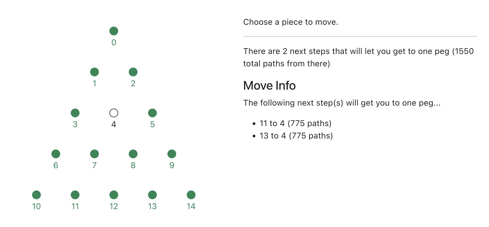

# Peg board solver

This is a fun little application that solves the [Peg game](https://shop.crackerbarrel.com/toys-games/games/travel-games/peg-game/606154) found at Cracker Barrel. Why? My kids kept getting stuck and wanted to fgure out how to solve it. So... I figured it out!

## How it works

Simply put, the app has populated every single possible combination of the game and all possible next steps. Each board layout is stored as a node in a graph database (using Neo4j) and the relationships connect the different layouts. By using a graph database, we can easily ask it "given this board", is it possible to get to a board with only one peg left?

## Running the app

Simply put, run `docker compose up`! Once it's all up and running, you can open the app at http://localhost.